# 面试官看完我手写的单例直接惊呆了！

参考：https://juejin.im/post/6877202342266175496?utm_source=gold_browser_extension

## 前言

单例模式应该算是 23 种设计模式中，最常见最容易考察的知识点了。经常会有面试官让手写单例模式，别到时候傻乎乎的说我不会。

之前，我有介绍过单例模式的几种常见写法。还不知道的，传送门看这里：

[设计模式之单例模式](https://mp.weixin.qq.com/s/1AbZGp6uwCNR0R3TYdDRlg)

本篇文章将展开一些不太容易想到的问题。带着你思考一下，传统的单例模式有哪些问题，并给出解决方案。让面试官眼中一亮，心道，小伙子有点东西啊！

以下，以 DCL 单例模式为例。

## DCL 单例模式

DCL 就是 **D**ouble **C**heck **L**ock 的缩写，即双重检查的同步锁。代码如下，

```java
public class Singleton {

    //注意，此变量需要用volatile修饰以防止指令重排序
    private static volatile Singleton singleton = null;

    private Singleton(){

    }

    public static Singleton getInstance(){
        //进入方法内，先判断实例是否为空，以确定是否需要进入同步代码块
        if(singleton == null){
            synchronized (Singleton.class){
                //进入同步代码块时再次判断实例是否为空
                if(singleton == null){
                    singleton = new Singleton();
                }
            }
        }
        return singleton;
    }
}
复制代码
```

乍看，以上的写法没有什么问题，而且我们确实也经常这样写。

但是，问题来了。

### DCL 单例一定能确保线程安全吗？

有的小伙伴就会说，你这不是废话么，大家不都这样写么，肯定是线程安全的啊。

确实，在正常情况，我可以保证调用 `getInstance` 方法两次，拿到的是同一个对象。

但是，我们知道 Java 中有个很强大的功能——**反射**。对的，没错，就是他。

通过反射，我就可以破坏单例模式，从而调用它的构造函数，来创建不同的对象。

```java
public class TestDCL {
    public static void main(String[] args) throws Exception {
        Singleton singleton1 = Singleton.getInstance();
        System.out.println(singleton1.hashCode()); // 723074861
        Class<Singleton> clazz = Singleton.class;
        Constructor<Singleton> ctr = clazz.getDeclaredConstructor();
        //通过反射拿到无参构造，设为可访问
        ctr.setAccessible(true);
        Singleton singleton2 = ctr.newInstance();
        System.out.println(singleton2.hashCode()); // 895328852
    }
}
复制代码
```

我们会发现，通过反射就可以直接调用无参构造函数创建对象。我管你构造器是不是私有的，反射之下没有隐私。

打印出的 hashCode 不同，说明了这是两个不同的对象。


### 那怎么防止反射破坏单例呢？

很简单，既然你想通过无参构造来创建对象，那我就在构造函数里多判断一次。如果单例对象已经创建好了，我就直接抛出异常，不让你创建就可以了。

修改构造函数如下，


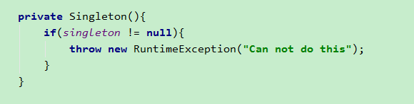


再次运行测试代码，就会抛出异常。


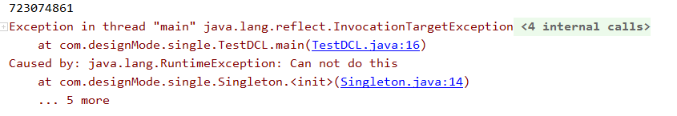


有效的阻止了通过反射去创建对象。

### 那么，这样写单例就没问题了吗？

这时，机灵的小伙伴肯定就会说，既然问了，那就是有问题（可真是个小机灵鬼）。

但是，是有什么问题呢？

我们知道，对象还可以进行序列化反序列化。那如果我把单例对象序列化，再反序列化之后的对象，还是不是之前的单例对象呢？

实践出真知，我们测试一下就知道了。

```java
// 给 Singleton 添加序列化的标志，表明可以序列化
public class Singleton implements Serializable{ 
    ... //省略不重要代码
}
//测试是否返回同一个对象
public class TestDCL {
    public static void main(String[] args) throws Exception {
        Singleton singleton1 = Singleton.getInstance();
        System.out.println(singleton1.hashCode()); // 723074861
        //通过序列化对象，再反序列化得到新对象
        String filePath = "D:\\singleton.txt";
        saveToFile(singleton1,filePath);
        Singleton singleton2 = getFromFile(filePath);
        System.out.println(singleton2.hashCode()); // 1259475182
    }

    //将对象写入到文件
    private static void saveToFile(Singleton singleton, String fileName){
        try {
            FileOutputStream fos = new FileOutputStream(fileName);
            ObjectOutputStream oos = new ObjectOutputStream(fos);
            oos.writeObject(singleton); //将对象写入oos
            oos.close();
        } catch (IOException e) {
            e.printStackTrace();
        }
    }

    //从文件中读取对象
    private static Singleton getFromFile(String fileName){
        try {
            FileInputStream fis = new FileInputStream(fileName);
            ObjectInputStream ois = new ObjectInputStream(fis);
            return (Singleton) ois.readObject();
        } catch (IOException e) {
            e.printStackTrace();
        } catch (ClassNotFoundException e) {
            e.printStackTrace();
        }
        return null;
    }
}
复制代码
```

可以发现，我把单例对象序列化之后，再反序列化之后得到的对象，和之前已经不是同一个对象了。因此，就破坏了单例。

### 那怎么解决这个问题呢？

我先说解决方案，一会儿解释为什么这样做可以。

很简单，在单例类中添加一个方法 readResolve 就可以了，方法体中让它返回我们创建的单例对象。


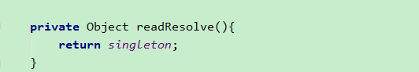


然后再次运行测试类会发现，打印出来的 hashCode 码一样。

是不是很神奇。。。


### readResolve 为什么可以解决序列化破坏单例的问题？

我们通过查看源码中一些关键的步骤，就可以解决心中的疑惑。

我们思考一下，序列化和反序列化的过程中，哪个流程最有可能有操作空间。

首先，序列化时，就是把对象转为二进制存在 ``ObjectOutputStream` 流中。这里，貌似好像没有什么特殊的地方。

其次，那就只能看反序列化了。反序列化时，需要从 `ObjectInputStream` 对象中读取对象，正常读出来的对象是一个新的不同的对象，为什么这次就能读出一个相同的对象呢，我猜这里会不会有什么猫腻？

应该是有可能的。所以，来到我们写的方法 `getFromFile`中，找到这一行`ois.readObject()`。它就是从流中读取对象的方法。


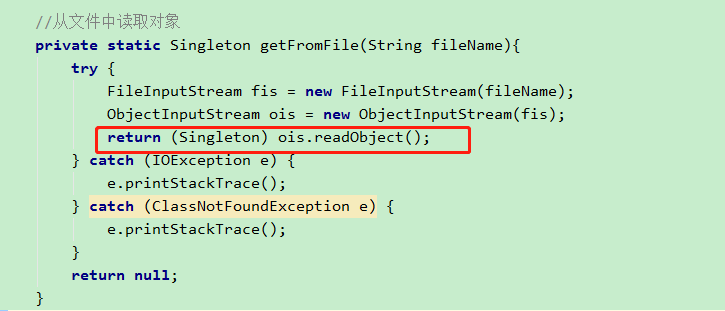


点进去，查看 `ObjectInputStream.readObject 方法`，然后找到 `readObject0()方法`


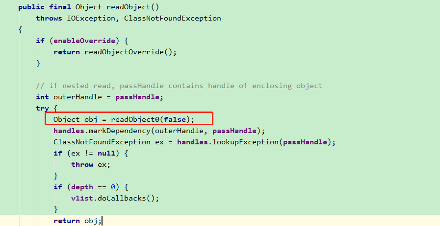


再点进去，我们发现有一个 switch 判断，找到 TC_OBJECT 分支。它是用来处理对象类型。


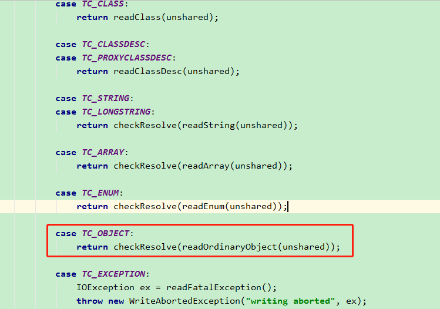


然后看到有一个 `readOrdinaryObject方法`，点进去。


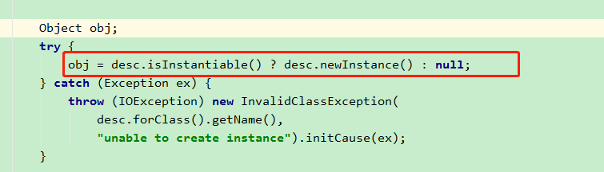


然后找到这一行，`isInstantiable()` 方法，用来判断对象是否可实例化。


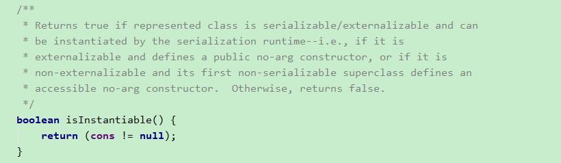


由于 cons 构造函数不为空，所以这个方法返回 true。因此构造出来一个 非空的 obj 对象 。

再往下走，调用，`hasReadResolveMethod` 方法去判断变量 `readResolveMethod`是否为非空。


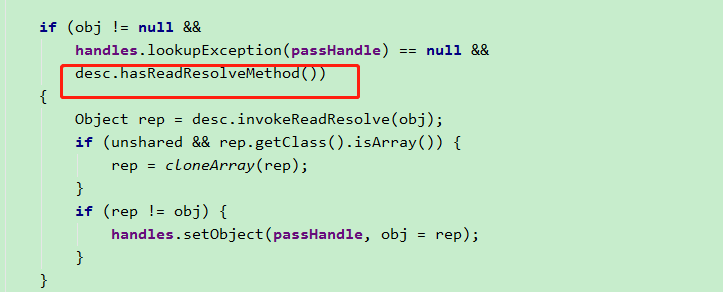


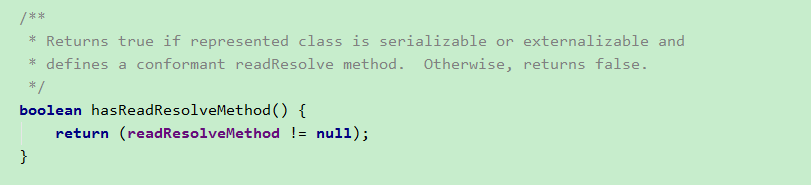


我们去看一下这个变量，在哪里有没有赋值。会发现有这样一段代码，


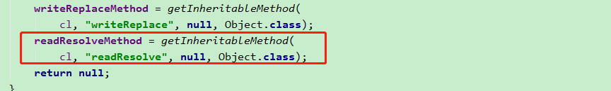


点进去这个方法 `getInheritableMethod`。发现它最后就是为了返回我们添加的`readResolve` 方法。


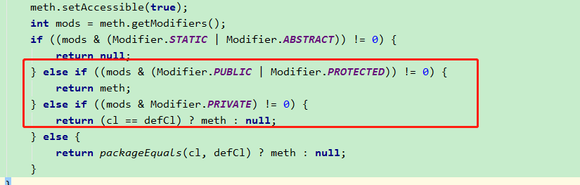


同时我们发现，这个方法的修饰符可以是 public , protected 或者 private（我们当前用的就是private）。但是，不允许使用 static 和 abstract 修饰。

再次回到 `readOrdinaryObject`方法，继续往下走，会发现调用了 `invokeReadResolve` 方法。此方法，是通过反射调用 `readResolve`方法，得到了 rep 对象。


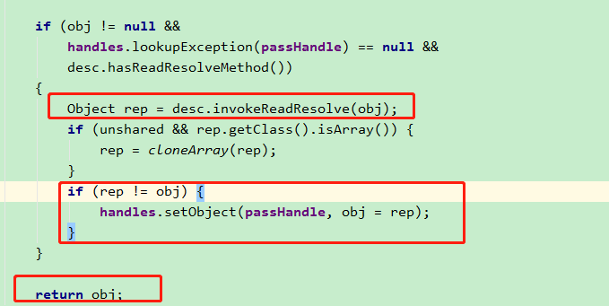


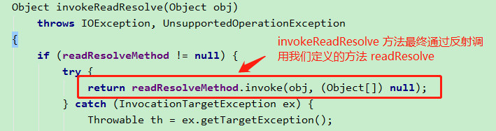


然后，判断 rep 是否和 obj 相等 。 obj 是刚才我们通过构造函数创建出来的新对象，而由于我们重写了 readResolve 方法，直接返回了单例对象，因此 rep 就是原来的单例对象，和 obj 不相等。

于是，把 rep 赋值给 obj ，然后返回 obj。

所以，最终得到这个 obj 对象，就是我们原来的单例对象。

至此，我们就明白了是怎么一回事。

**一句话总结就是**：当从对象流 ObjectInputStream 中读取对象时，会检查对象的类否定义了 readResolve 方法。如果定义了，则调用它返回我们想指定的对象（这里就指定了返回单例对象）。

## 总结

因此，完整的 DCL 就可以这样写，

```java
public class Singleton implements Serializable {

    //注意，此变量需要用volatile修饰以防止指令重排序
    private static volatile Singleton singleton = null;

    private Singleton(){
        if(singleton != null){
            throw new RuntimeException("Can not do this");
        }
    }

    public static Singleton getInstance(){
        //进入方法内，先判断实例是否为空，以确定是否需要进入同步代码块
        if(singleton == null){
            synchronized (Singleton.class){
                //进入同步代码块时再次判断实例是否为空
                if(singleton == null){
                    singleton = new Singleton();
                }
            }
        }
        return singleton;
    }

    // 定义readResolve方法，防止反序列化返回不同的对象
    private Object readResolve(){
        return singleton;
    }
}
复制代码
```

另外，不知道细心的读者有没有发现，在看源码中 switch 分支有一个 `case TC_ENUM` 分支。这里，是对枚举类型进行的处理。

感兴趣的小伙伴可以去研读一下，最终的效果就是，我们通过枚举去定义单例，就可以防止序列化破坏单例。

> 微信搜「烟雨星空」，白嫖更多好文~