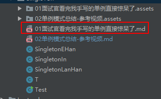
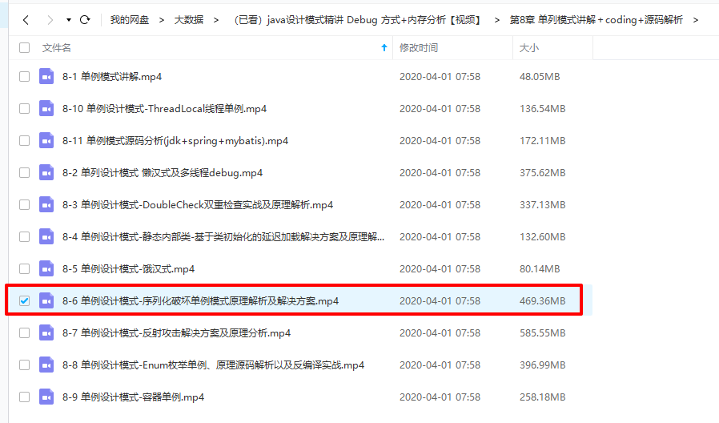

# 一、懒加载

## 1.基于类初始化的延迟加载方案

参考：https://blog.csdn.net/leon_jinhai_sun/article/details/90714915


### 1.1 原理

​		刚刚线程1看不到线程0的重排序,我们创建一个类,这个方案是使用静态内部类来解决,一会我们也会分析一下原理,创建一个静态内部类,静态内部类的代理模式,JVM在类的初始化阶段,也就是class被加载后,并且被线程使用之前,类的初始化阶段,在这个阶段会执行类的初始化。那在执行类的初始化期间呢,JVM会去获取一个锁,这个锁可以同步线程,对一个类的初始化,也就是绿色的部分,基于这个特性,我们可以实现基于内部类的并且是线程安全的,延迟化方案。

​	那我们看一下这个图,还是线程0和线程1,蓝色和红色,那在这种实现模式中呢,对于右侧的2和3,也就是橙色的框,两个步骤的重排序,对于我们前面讲的,线程1并不会看到,也就是说,非构造线程是不允许看到重排序的,因为我们之前是讲的程0来构造这个单例对象,初始化一个类,包括执行类的静态初始化,还有初始化在这个类中声明的静态变量。

​	根据JAVA语言规范,一个类将被立刻初始化主要分5种情况,首次发生的时候呢,一个类将被立刻初始化,这里所说的类呢,泛指包括接口interface,也是一个类,那假设这个类是A,那现在我们说一下,这几种情况,都会导致这个A类,被立刻初始化

（1）首先，第一种情况,有一个A类型的实例被创建,

（2）A类型中的一个静态方法被调用

（3）第三种情况呢,是A类中声明的一个静态成员,被赋值,

（4）第四种情况,A类中声明的一个静态成员被使用,并且这个成员不是一个常量成员,

前四种我们实际工作中用的比较多,

（5）第五种用的比较少,也就是说如果A类是一个顶级类,关于顶级类在JAVA语言规范里面的介绍,并且呢在这个类中,有嵌套的断言语句,这种情况呢A类也会立刻被初始化,也就是说刚刚说的五种情况,

前四种是我们经常会被碰到的,只要首次发生以上说的一个情况,这个类就会被立刻初始化,把我们看一下这个图,当线程0和线程1试图想获取这个锁的时候,也就是获得class对象的初始化锁,这个时候肯定只有一个线程能获得这个锁,假设线程0获得这个锁了,线程0执行内部类的一个初始化,对于静态内部类即使23之间存在重排序,但是线程1是无法看到这个重排序的,因为这里有一个class对象的初始化锁,因为这里面有锁,对于线程0而言,初始化这个静态内部类的时候,也就是把这个instance new出来,可以看到我们这里还有一个大框,所以23怎么排序无所谓,线程1看不到,因为线程1在绿色区域等待着,所以静态内部类就是基于类初始化的延迟加载解决方案,那我们回到代码里。

### 1.2 代码和验证

#### 备注：为什么外部类可以直接访问内部静态类的成员变量

https://blog.csdn.net/xjk201/article/details/81022435

#### 实现代码

```java
package com.learn.design.pattern.creational.singleton;
 
/**
 * 前面说了我们使用静态内部类
 * 
 * 
 * 
 * @author Leon.Sun
 *
 */
public class StaticInnerClassSingleton {
	/**
	 * 这个class要声明成private的class
	 * 权限一定要控制好
	 * @author Leon.Sun
	 *
	 */
    private static class InnerClass{
    	/**
    	 * new一个StaticInnerClassSingleton
    	 * 那在这个静态内部类里边直接new了一个StaticInnerClassSingleton这个类的对象
    	 * 并且它是private和static的
    	 */
        private static StaticInnerClassSingleton staticInnerClassSingleton = new StaticInnerClassSingleton();
    }
    /**
     * 那我们要开放获取这个对象的方法，所以是public的
     * 返回值肯定是StaticInnerClassSingleton
     * 通过这个静态内部类InnerClass点静态的成员staticInnerClassSingleton
     * 那这个静态内部类的单例模式就完成了
     *  
     * @return
     */
    public static StaticInnerClassSingleton getInstance(){
        return InnerClass.staticInnerClassSingleton;
    }
 
    /**
     * 私有的构造器肯定是要有的
     * 否则外部就可以new出来了
     * 所以这一点千万不要忘记
     * 如果之前写的时候没有发现这个问题的话
     * 对声明构造器一定要加深
     * 现在我们来到Test直接run一下
     * 我们可以看到线程0和线程1拿到的是同一个
     * 希望对着两种方案和思路来引入静态内部类和doublecheck一步一步解决什么问题
     * 可以自己回顾一下
     * 总结一下
     * 
     */
    private StaticInnerClassSingleton(){
        if(InnerClass.staticInnerClassSingleton != null){
            throw new RuntimeException("单例构造器禁止反射调用");
        }
    }
}

```

#### 测试代码

```java
package com.learn.design.pattern.creational.singleton;
 
public class T implements Runnable {
    @Override
    public void run() {
//        LazySingleton lazySingleton = LazySingleton.getInstance();
//        System.out.println(Thread.currentThread().getName()+"  "+lazySingleton);
//        LazyDoubleCheckSingleton instance = LazyDoubleCheckSingleton.getInstance();
    	/**
    	 * 通过这个类的getInstance方法
    	 * 看上去没有什么区别
    	 * 但是里面使用的是静态内部类
    	 * 而且是一个private的
    	 * 
    	 */
        StaticInnerClassSingleton instance = StaticInnerClassSingleton.getInstance();;
 
//        ContainerSingleton.putInstance("object",new Object());
//        Object instance = ContainerSingleton.getInstance("object");
//        ThreadLocalInstance instance = ThreadLocalInstance.getInstance();
 
        System.out.println(Thread.currentThread().getName()+"  "+instance);
 
    }
}


```

```java
package com.learn.design.pattern.creational.singleton;
 
import java.io.IOException;
import java.lang.reflect.InvocationTargetException;
 
public class Test {
    public static void main(String[] args) throws IOException, ClassNotFoundException, NoSuchMethodException, IllegalAccessException, InvocationTargetException, InstantiationException {
//        LazySingleton lazySingleton = LazySingleton.getInstance();
 
//        System.out.println("main thread"+ThreadLocalInstance.getInstance());
//        System.out.println("main thread"+ThreadLocalInstance.getInstance());
//        System.out.println("main thread"+ThreadLocalInstance.getInstance());
//        System.out.println("main thread"+ThreadLocalInstance.getInstance());
//        System.out.println("main thread"+ThreadLocalInstance.getInstance());
//        System.out.println("main thread"+ThreadLocalInstance.getInstance());
 
        Thread t1 = new Thread(new T());
        Thread t2 = new Thread(new T());
        t1.start();
        t2.start();
        System.out.println("program end");
 
//        HungrySingleton instance = HungrySingleton.getInstance();
//        EnumInstance instance = EnumInstance.getInstance();
//        instance.setData(new Object());
//
//        ObjectOutputStream oos = new ObjectOutputStream(new FileOutputStream("singleton_file"));
//        oos.writeObject(instance);
//
//        File file = new File("singleton_file");
//        ObjectInputStream ois = new ObjectInputStream(new FileInputStream(file));
//
        HungrySingleton newInstance = (HungrySingleton) ois.readObject();
//        EnumInstance newInstance = (EnumInstance) ois.readObject();
//
//        System.out.println(instance.getData());
//        System.out.println(newInstance.getData());
//        System.out.println(instance.getData() == newInstance.getData());
 
//        Class objectClass = HungrySingleton.class;
//        Class objectClass = StaticInnerClassSingleton.class;
 
//        Class objectClass = LazySingleton.class;
//        Class objectClass = EnumInstance.class;
 
//        Constructor constructor = objectClass.getDeclaredConstructor(String.class,int.class);
//
//        constructor.setAccessible(true);
//        EnumInstance instance = (EnumInstance) constructor.newInstance("Geely",666);
 
 
//
//        LazySingleton newInstance = (LazySingleton) constructor.newInstance();
//        LazySingleton instance = LazySingleton.getInstance();
 
 
 
//        StaticInnerClassSingleton instance = StaticInnerClassSingleton.getInstance();
//        StaticInnerClassSingleton newInstance = (StaticInnerClassSingleton) constructor.newInstance();
 
//        HungrySingleton newInstance = (HungrySingleton) constructor.newInstance();
//        HungrySingleton instance = HungrySingleton.getInstance();
 
 
//        System.out.println(instance);
//        System.out.println(newInstance);
//        System.out.println(instance == newInstance);
 
//        EnumInstance instance = EnumInstance.getInstance();
//        instance.printTest();
 
 
    }
}

```


## 2.基于枚举类实现的单例

### 2.1 参考视频：

https://pan.baidu.com/disk/home#/all?vmode=list&path=%2F%E5%A4%A7%E6%95%B0%E6%8D%AE%2F%EF%BC%88%E5%B7%B2%E7%9C%8B%EF%BC%89java%E8%AE%BE%E8%AE%A1%E6%A8%A1%E5%BC%8F%E7%B2%BE%E8%AE%B2%20Debug%20%E6%96%B9%E5%BC%8F%2B%E5%86%85%E5%AD%98%E5%88%86%E6%9E%90%E3%80%90%E8%A7%86%E9%A2%91%E3%80%91%2F%E7%AC%AC8%E7%AB%A0%20%E5%8D%95%E5%88%97%E6%A8%A1%E5%BC%8F%E8%AE%B2%E8%A7%A3%EF%BC%8Bcoding%2B%E6%BA%90%E7%A0%81%E8%A7%A3%E6%9E%90

### 2.2 参考文章

[关于Enum枚举单例模式的实现](https://blog.csdn.net/ls0111/article/details/80136215)


### 3.3 总结文章

[03单例模式-枚举.md](https://github.com/RayBreslinwcl/algorithm/blob/master/src/main/java/com/algorithm/learn/DesignPattern/SingleTon/03%E5%8D%95%E4%BE%8B%E6%A8%A1%E5%BC%8F-%E6%9E%9A%E4%B8%BE.md)


### 3.4 相关代码

https://github.com/RayBreslinwcl/algorithm/tree/master/src/main/java/com/algorithm/learn/DesignPattern/SingleTon/enumSingle


# 二、饿加载

# 三、各种破坏强化

## 1.序列化和非序列化破坏和修复

### 1.1 解决方法：参考



### 参考视频：[链接](https://pan.baidu.com/disk/home#/all?vmode=list&path=%2F%E5%A4%A7%E6%95%B0%E6%8D%AE%2F%EF%BC%88%E5%B7%B2%E7%9C%8B%EF%BC%89java%E8%AE%BE%E8%AE%A1%E6%A8%A1%E5%BC%8F%E7%B2%BE%E8%AE%B2%20Debug%20%E6%96%B9%E5%BC%8F%2B%E5%86%85%E5%AD%98%E5%88%86%E6%9E%90%E3%80%90%E8%A7%86%E9%A2%91%E3%80%91%2F%E7%AC%AC8%E7%AB%A0%20%E5%8D%95%E5%88%97%E6%A8%A1%E5%BC%8F%E8%AE%B2%E8%A7%A3%EF%BC%8Bcoding%2B%E6%BA%90%E7%A0%81%E8%A7%A3%E6%9E%90)




### 1.2 代码

```java
public class Singleton implements Serializable {

    //注意，此变量需要用volatile修饰以防止指令重排序
    private static volatile Singleton singleton = null;

    private Singleton(){
        if(singleton != null){
            throw new RuntimeException("Can not do this");
        }
    }

    public static Singleton getInstance(){
        //进入方法内，先判断实例是否为空，以确定是否需要进入同步代码块
        if(singleton == null){
            synchronized (Singleton.class){
                //进入同步代码块时再次判断实例是否为空
                if(singleton == null){
                    singleton = new Singleton();
                }
            }
        }
        return singleton;
    }

    // 定义readResolve方法，防止反序列化返回不同的对象
    private Object readResolve(){
        return singleton;
    }
}

```

### 1.3 总结

视频讲解非常清晰！然后，理解了因为可以序列化，导致反射创建了一个新对象。解决方法，就是重写readResolve方法，然后，会在oos读取对象的时候，最后进入这个readResolve方法，直接返回已经创建好的单例对象，而不是通过反射创建的那个 对象！

网页参考，可以当作参考

