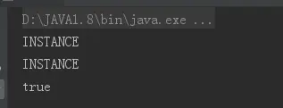
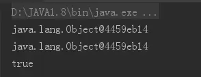
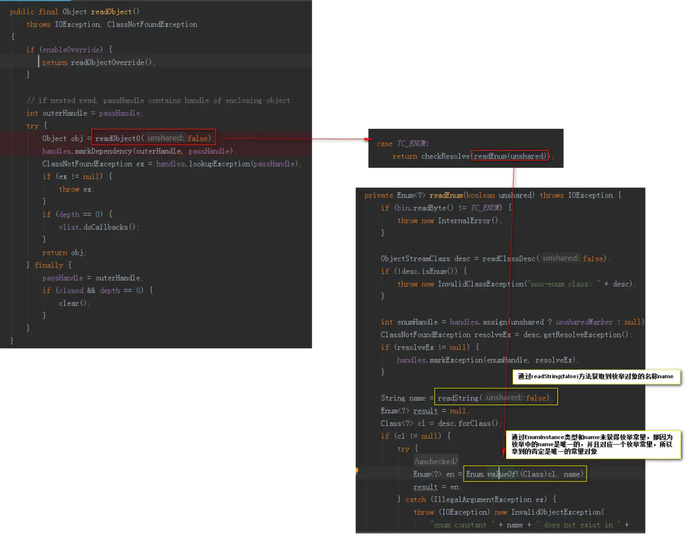
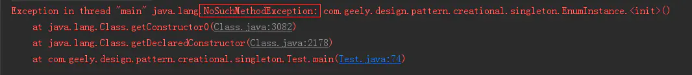
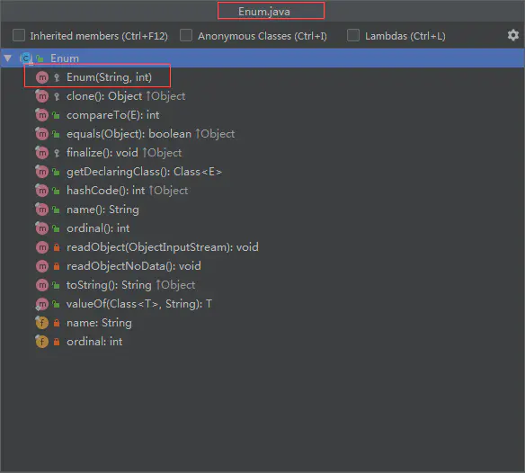
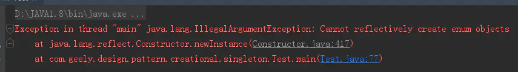
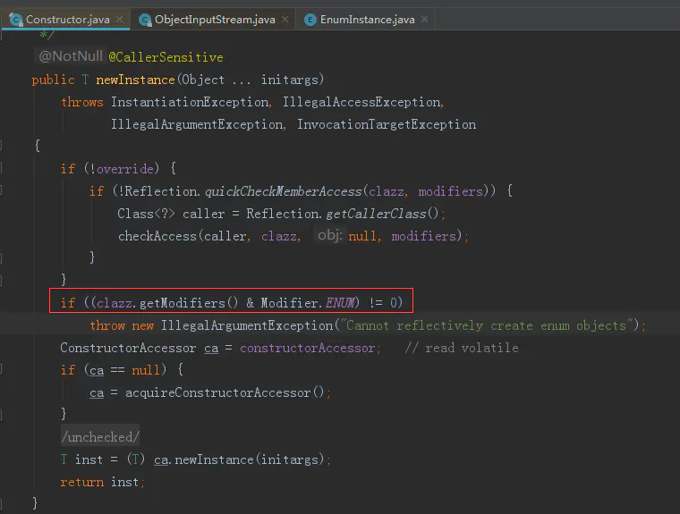
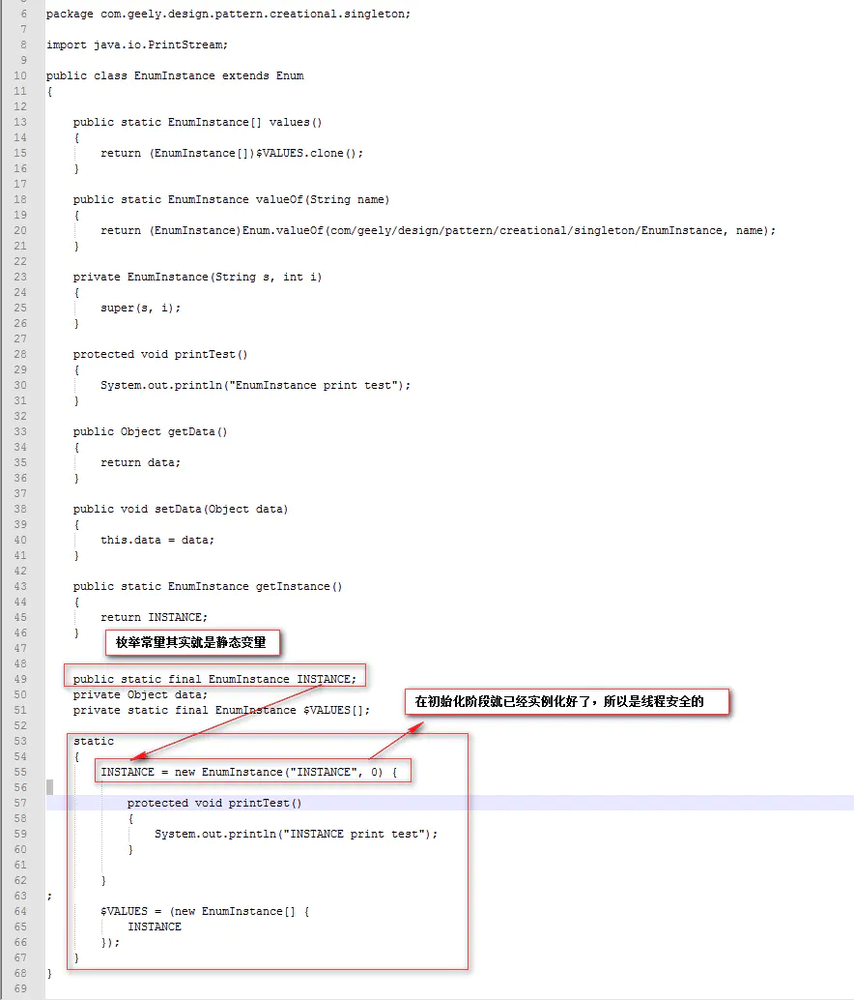

# 单例模式-Enum枚举单例

参考：https://www.jianshu.com/p/90d4f1597659

用枚举来实现单例
枚举类在多线程情况下也是线程安全的，具体原因下文反编译的时候会提及。

```csharp
package com.geely.design.pattern.creational.singleton;

/**
 * Created by geely
 */
public enum EnumInstance {
    INSTANCE{
        @Override
        protected void printTest(){
            System.out.println("INSTANCE print test");
        }
    };
    protected void printTest(){
        System.out.println("EnumInstance print test");
    }
    private Object data;

    public Object getData() {
        return data;
    }

    public void setData(Object data) {
        this.data = data;
    }
    public static EnumInstance getInstance(){
        return INSTANCE;
    }
}
```

# 序列化

枚举类天然的可序列化机制，能够保证不会出现多次实例化的情况。
先测试这个instance枚举是否会被序列化破坏单例模式。

```swift
package com.geely.design.pattern.creational.singleton;

import java.io.File;
import java.io.FileInputStream;
import java.io.FileNotFoundException;
import java.io.FileOutputStream;
import java.io.IOException;
import java.io.ObjectInputStream;
import java.io.ObjectOutputStream;
import java.lang.reflect.Constructor;
import java.lang.reflect.InvocationTargetException;

/**
 * Created by geely
 */
public class Test {
    public static void main(String[] args) throws IOException, NoSuchMethodException{
        EnumInstance instance = EnumInstance.getInstance();
        ObjectOutputStream oos = new ObjectOutputStream(new FileOutputStream("singleton_file"));
        oos.writeObject(instance);

        File file = new File("singleton_file");
        ObjectInputStream ois = new ObjectInputStream(new FileInputStream(file));
        EnumInstance newInstance = (EnumInstance) ois.readObject();

        System.out.println(instance);
        System.out.println(newInstance);
        System.out.println(instance == newInstance);
    }
}
```

结果：




没有被破坏单例模式。

一般用的是枚举类持有的对象data，再测试一下instance持有的对象有没被破坏单例模式。


```swift
package com.geely.design.pattern.creational.singleton;

import java.io.File;
import java.io.FileInputStream;
import java.io.FileNotFoundException;
import java.io.FileOutputStream;
import java.io.IOException;
import java.io.ObjectInputStream;
import java.io.ObjectOutputStream;
import java.lang.reflect.Constructor;
import java.lang.reflect.InvocationTargetException;

/**
 * Created by geely
 */
public class Test {
    public static void main(String[] args) throws IOException, NoSuchMethodException{
        EnumInstance instance = EnumInstance.getInstance();
        instance.setData(new Object());
        ObjectOutputStream oos = new ObjectOutputStream(new FileOutputStream("singleton_file"));
        oos.writeObject(instance);

        File file = new File("singleton_file");
        ObjectInputStream ois = new ObjectInputStream(new FileInputStream(file));
        EnumInstance newInstance = (EnumInstance) ois.readObject();

        System.out.println(instance.getData());
        System.out.println(newInstance.getData());
        System.out.println(instance.getData() == newInstance.getData());

    }
}
```

结果：




枚举持有的对象也是没有被序列化破坏单例模式。

来看看序列化和反序列化对枚举类是怎么处理的。




通过readString(false)方法获取到枚举对象的名称name，通过EnumInstance类型和name来获得枚举常量，那因为枚举中的name是唯一的，并且对应一个枚举常量，所以拿到的肯定是唯一的常量对象，这样就没有创建新的对象，维持了这个对象的单例属性。

# 反射攻击


```tsx
package com.geely.design.pattern.creational.singleton;

import java.lang.reflect.Constructor;

/**
 * Created by geely
 */
public class Test2 {
    public static void main(String[] args) throws NoSuchMethodException {
        Class objectClass = EnumInstance.class;
        Constructor constructor = objectClass.getDeclaredConstructor();
        constructor.setAccessible(true);

    }
}
```

结果



提示没有无参构造函数




看java.lang.Enum类源码确实如此。那我们改造一下测试代码。

结果：




虽然获取到了对应的构造函数，但是提示说不能够用反射新建Enum对象。
这是为什么呢？我们看一下Constructor源码





这里判断使用newInstance()方法的目标类是不是枚举类型，是就会抛出错误。

枚举类在多线程情况下为什么是线程安全的？
对EnumInstance进行反编译



